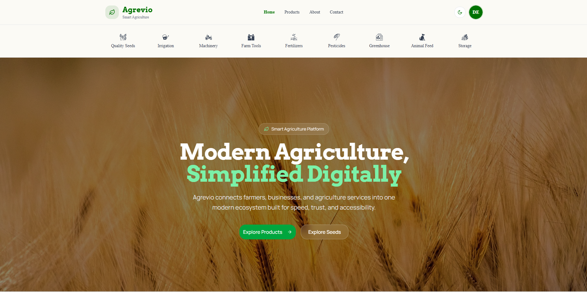
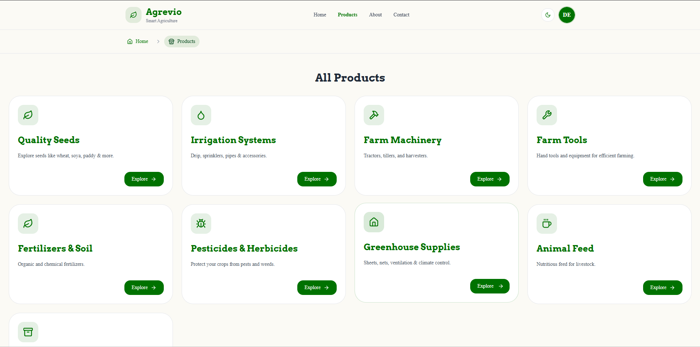
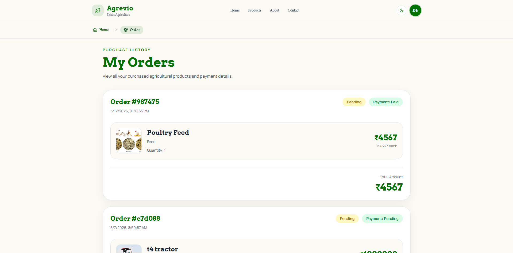
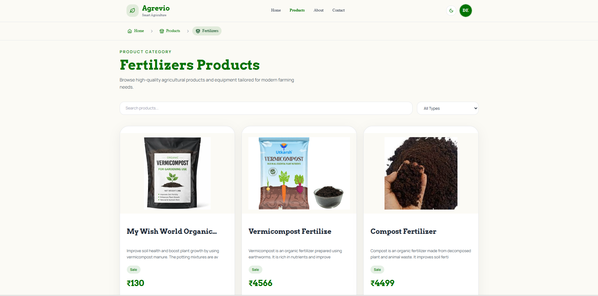

# Agrevio 🌿

Agrevio is a full-stack platform for the agriculture ecosystem that enables users and businesses to **buy, sell, and rent agricultural equipment and products**. It combines e-commerce and rental workflows into a single scalable system.


  

## Experience it LIVE : https://agrevio.vercel.app/

---


## Table of Contents

- [Overview](#overview)  
- [Tech Stack](#tech-stack)  
- [Architecture](#architecture)  
- [Key Features](#key-features)  
- [Project Structure](#project-structure)  
- [Installation & Setup](#installation--setup)  
- [Environment Variables](#environment-variables)  
- [API Endpoints Samples](#api-endpoints-samples)  
- [Screenshots](#screenshots)  
- [Future Improvements](#future-improvements)  
- [Contributors](#contributors)  
- [License](#license)

  

## Overview

  

Agrevio provides a unified platform where:

  

- Users can purchase agricultural products

- Users and vendors can list equipment for rent or sale

- Companies can manage product listings and inventory

- Users can book equipment for specific time slots

- Secure authentication ensures safe access

- Integrated payments support both orders and rentals

  

---

  

## Tech Stack

  

### Backend

  

- Node.js
- Express.js
- MongoDB (Mongoose ODM)
- JWT Authentication

  

### Frontend

  

- React.js
- Redux Toolkit & RTK Query
- React Router DOM
- Tailwind CSS
- Lucide React Icons
- Next Themes

### Deployment & Tools


- Vercel (Frontend Hosting)
- Render (Backend Hosting)
- MongoDB Atlas
- Git & GitHub
- Postman

---

  

## Architecture

### Backend Architecture

The backend follows a layered architecture pattern to maintain scalability, modularity, and clean code organization.

  

  

- **Routes** — Define API endpoints and route handlers  
- **Controllers** — Handle incoming requests and responses  
- **Services** — Contain business logic and core operations  
- **Repositories** — Manage database interaction and queries  
- **Models** — Define MongoDB schemas using Mongoose  
- **Middlewares** — Handle authentication, authorization, and validations  
- **Utils** — Shared helper utilities (ApiError, ApiResponse, asyncHandler, etc.)


### Frontend Structure

The frontend is organized using a feature-based structure for better maintainability and scalability.

- **Components** — Reusable UI components
- **Pages** — Application pages and routes
- **Features** — Redux Toolkit slices and RTK Query APIs
- **Layouts** — Shared application layouts
- **Constants** — Static constants and configuration
- **Utils** — Helper functions and utilities
- **Assets** — Images, icons, and static resources


---

## Key Features

### Authentication & Security

- JWT-based authentication (Access + Refresh Tokens)
    
- Cookie-based session handling
    
- Token rotation for enhanced security
    

### Product Management

- Create, update, and manage products
    
- Supports:
    
    - Sale
        
    - Rent
        
    - Hybrid (Sale + Rent)
        
- Pagination, filtering, and search support
    

### Rental Booking System

- Time-based booking model
    
- Conflict detection (prevents overlapping bookings)
    
- Optional delivery handling
    

### Order Management

- Cart-based checkout system
    
- Order history and tracking
    

### Payment Integration

- Stripe-powered payment flow
    
- Unified handling for:
    
    - Product purchases
        
    - Equipment bookings
        

---

## Project Structure

```
client/
  src/
    app/
    assets/
    components/
    constants/
    features/
    layout/
    pages/
    utils/

server/
  src/
    config/
    controllers/
    middleware/
    models/
    repositories/
    routes/
    services/
    utils/

```
---

## Installation & Setup

### 1. Clone the Repository

```
git clone <repo-url>
cd agrevio
```

### 2. Backend Setup

```
cd server
npm install
npm run dev
```

### 3. Frontend Setup

```
cd client
npm install
npm run dev
```


---

## Environment Variables

Refer to this : [.env.example](./server/.env.example) file for the required environment variables.

---


## API Endpoints Samples

### Authentication
| Method | Endpoint | Description |
|---|---|---|
| POST | `/api/v1/auth/register` | Register a new user |
| POST | `/api/v1/auth/login` | Login user |
| POST | `/api/v1/auth/logout` | Logout user |
| POST | `/api/v1/auth/refresh-token` | Refresh Token |

### Users
| Method | Endpoint | Description |
|---|---|---|
| GET | `/api/v1/users/me` | Get current user profile |
| PATCH | `/api/v1/users/become-seller` | Become a seller |

### Cart
| Method | Endpoint | Description |
|---|---|---|
| POST | `/api/v1/users/cart` | Add to cart |
| GET | `/api/v1/users/cart` | Get cart items |
| DELETE | `/api/v1/users/cart:productID` | Remove item from cart |
| DELETE | `/api/v1/users/cart` | Clear cart |


### Products
| Method | Endpoint | Description |
|---|---|---|
| GET | `/api/v1/products` | Get all products |
| GET | `/api/v1/products/:id` | Get single product |
| POST | `/api/v1/products` | Create product |

### Orders
| Method | Endpoint | Description |
|---|---|---|
| GET | `/api/v1/orders` | Get user orders |
| POST | `/api/v1/orders` | Create order |

### Payments
| Method | Endpoint | Description |
|---|---|---|
| POST | `/api/v1/payments/checkout` | Create Stripe checkout session |
| POST | `/api/v1/payments/webhook` | Stripe webhook handler |
---

---

## Screenshots






  

## Future Improvements

  

- Vendor verification system
    
- Image upload & profile edit feature
    
- Advanced filtering & recommendations
    
- Notification system (Email/SMS)
    
- Admin dashboard with analytics
    
- Review & rating system


## Contributors

- Ravi Dhakad – GitHub: https://github.com/RaviD98  | LinkedIn: https://www.linkedin.com/in/ravidhakad98/
    
- Abhishek SP - GitHub: https://github.com/abhishekSingh930  | LinkedIn: https://www.linkedin.com/in/abhisheks930/
    
- Sumit - GitHub: https://github.com/Sumit-Goyal35  | https://www.linkedin.com/in/sumit-goyal-/

---


## License

This project is licensed under the MIT License.
